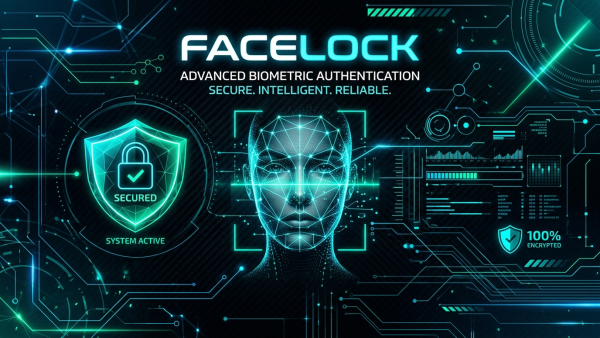

<p align="center">
  
</p>

# FaceLock

A lightweight, all-in-one biometric security system with built-in **3D liveness detection, anti-spoofing, continuous auto-lock, and lock-screen auto-unlock (PAM)** for **Linux** and **macOS**. It continuously monitors your webcam while your session is active and automatically locks the screen when you step away. When locked on Linux, waking the screen activates FaceLock's built-in PAM authenticator to seamlessly unlock your desktop using your face — **completely self-contained with no external tools required**.

Tested on **Ubuntu 24.04** (GNOME on X11 / Wayland, GDM) and **macOS Sonoma / Sequoia** (Apple Silicon & Intel).

---

## ✨ Features

- 🛡️ **Continuous Inactivity Auto-Lock**: Automatically locks the desktop when you step away.
- 👁️ **3D Liveness & Anti-Spoofing**: Uses 3D head-pose estimation (`cv2.solvePnP`) to track involuntary human micro-movements and posture drift, rejecting static printed photos and screen replays.
- 🖥️ **Interactive Graphical Setup Wizard (`facelock-gui`)**: Live webcam HUD with cyber-bracketed face boxes, facial landmarks, 3D pose angles, step-by-step guided captures, and real-time verification testing.
- ⚡ **Zero Heavy Build Toolchains**: Powered by OpenCV's bundled YuNet (detector) and SFace (recognizer) ONNX models — no `dlib`, `cmake`, or C++ compilation required.
- 🤝 **Camera-Friendly Coexistence**: Releases the webcam immediately upon session lock so PAM unlockers have unobstructed hardware access.
- 🚀 **One-Command Installation**: Simple curl installer that sets up `/opt/facelock`, command symlinks, and a `systemd --user` service.

---

## 🚀 Install

### Linux (Ubuntu / Debian / Fedora / Arch)

```bash
curl -fsSL https://raw.githubusercontent.com/towfiq-ul/face-id-screen-lock/master/install.sh | bash
```

The installer displays a branded banner with percentage progress bars:
1. Sets up an isolated Python environment at `/opt/facelock`.
2. Symlinks `facelock-gui`, `facelock-enroll`, and `facelock-monitor` into `/usr/local/bin`.
3. Installs and enables the `systemd --user` background service.
4. Launches the **Face Setup GUI** wizard so you can enroll your face immediately.

### macOS (Apple Silicon & Intel)

1. Install prerequisites via Homebrew:
   ```bash
   brew install python@3.12 python-tk@3.12
   ```

2. Run the automated installer:
   ```bash
   ./install_macos.sh
   # Or via Make:
   make macos-install
   ```

The macOS installer:
1. Creates an isolated environment at `~/.local/opt/facelock`.
2. Symlinks commands into `/usr/local/bin` (or `/opt/homebrew/bin`).
3. Configures a `launchd` LaunchAgent (`~/Library/LaunchAgents/com.facelock.monitor.plist`) to monitor presence in user sessions.
4. *Camera Permission*: On first launch, macOS will prompt to grant Camera access to Terminal / Python. Confirm in **System Settings → Privacy & Security → Camera**.

---

## 🛠️ Local / Development Setup

If you are developing or prefer running from a local git clone:

```bash
make venv           # creates .venv and installs facelock in editable mode
make gui            # launch graphical setup wizard with splash banner & live camera HUD
make calibrate      # interactive camera and biometric resting pose calibration studio
make test-face      # test live camera feed against saved profile with interactive HUD
make test-face-cli  # test live camera feed against saved profile in terminal mode
make enroll         # (or CLI mode) capture your face from the terminal
make test           # run the full automated unit test suite
make run            # run the monitor daemon in the foreground for debugging
```

---

## ⚙️ Configuration

Configuration is automatically generated on first run at `~/.config/facelock/config.yaml`:

```yaml
camera_index: 0                    # V4L2 webcam index (/dev/video0)
check_interval_seconds: 2.0        # Seconds between camera polls
unknown_face_timeout_seconds: 60.0 # Time without enrolled face before locking
match_threshold: 0.363             # SFace cosine-similarity match threshold
detection_score_threshold: 0.9     # YuNet face detection confidence
enroll_frame_count: 8              # Number of distinct angles captured during setup
liveness_enabled: true             # Enable anti-spoofing micro-movement & texture checks
liveness_min_pose_variance: 0.2    # Minimum angular std dev in degrees across sliding window
liveness_window_size: 5            # Number of consecutive observations in evaluation window
texture_anti_spoof_enabled: true   # Check image sharpness/glare to detect screen replays
```

All state lives under standard user XDG directories (`~/.config/facelock/`, `~/.local/share/facelock/`). FaceLock's background monitor daemon runs entirely in unprivileged user space.

---

## 🛡️ Liveness & Anti-Spoofing Architecture

Unlike basic face detectors that can be bypassed with a printed photo or phone screen, FaceLock incorporates passive and active anti-spoofing defense:

1. **3D Head-Pose Estimation (`cv2.solvePnP`)**:
   Projects a canonical 3D facial model to YuNet’s 5 2D landmarks (eyes, nose, mouth corners) to calculate real-time pitch, yaw, and roll angles.
2. **Temporal Micro-Movement Variance**:
   Real humans continually produce involuntary micro-movements, breathing oscillations, and posture shifts. `LivenessTracker` monitors pose standard deviation across a sliding window. Inanimate 2D photos exhibit near-zero variance and are flagged as `static_pose_detected`.
3. **Texture & Specular Glare Analysis**:
   Evaluates Laplacian sharpness variance across the face ROI to detect out-of-focus prints, paper grain, and screen glare.
4. **Interactive Multi-Angle Enrollment**:
   During setup, the wizard enforces angular pose displacement across 8 angles, preventing users or attackers from enrolling a single static photo.

---

## 🔄 Running as a Service

### Linux (`systemd --user`)

Control the background user daemon with `systemd`:

```bash
make service-install    # installs and enables the systemd --user unit
make service-logs       # follow real-time logs in journalctl
make service-uninstall  # stop and remove the user service
```

Or directly via `systemctl`:

```bash
systemctl --user status facelock-monitor
systemctl --user restart facelock-monitor
journalctl --user -u facelock-monitor -f
```

### macOS (`launchd`)

The macOS background monitor daemon is managed via `launchd`:

```bash
# Load / Start the LaunchAgent
launchctl load ~/Library/LaunchAgents/com.facelock.monitor.plist

# Unload / Stop the LaunchAgent
launchctl unload ~/Library/LaunchAgents/com.facelock.monitor.plist

# Tail real-time service logs
tail -f ~/Library/Logs/FaceLock/facelock-monitor.log
```

---

## 📦 System-Wide Install & Uninstall

### Linux
From a local clone:

```bash
sudo ./install.sh
```

To remove everything installed by the Linux installer:

```bash
sudo /opt/facelock/uninstall.sh
```

### macOS
From a local clone:

```bash
make macos-install      # or ./install_macos.sh
```

To remove everything installed by the macOS installer:

```bash
make macos-uninstall    # or ~/.local/opt/facelock/uninstall.sh
```

*(Your face profile and configuration at `~/.local/share/facelock/` and `~/.config/facelock/` are preserved during uninstallation).*

---

## 🔐 Built-in Biometric Auto-Unlock (Linux PAM)
FaceLock includes its own native PAM authentication engine for Linux — **no third-party packages required**!

When your screen is locked (e.g. via <kbd>Super</kbd> + <kbd>L</kbd> or auto-lock timeout):
1. Wake the lock screen (tap <kbd>Space</kbd>, <kbd>Enter</kbd>, or move mouse).
2. FaceLock's native PAM engine (`facelock-auth`) instantly activates the webcam, detects your face, verifies 3D liveness, and **unlocks your desktop in ~1 second**.
3. If an unrecognized person is in front of the camera, it seamlessly falls back to standard password entry.

To manage PAM auto-unlock:

```bash
make pam-status     # check whether lock-screen auto-unlock is active
make pam-enable     # enable FaceLock PAM unlock for lock screen (sudo)
make pam-disable    # disable PAM unlock and revert to standard password
```

*(You can also enable face authentication for terminal `sudo` via `sudo facelock-pam enable --sudo`).*

> **Note on macOS**: On macOS, screen auto-lock when absent is fully supported out of the box via `MacOSBackend`. However, lock-screen auto-unlock is managed exclusively by Apple's Secure Enclave and `loginwindow` (Touch ID / Apple Watch).

---

## 🧪 Testing

FaceLock includes a test suite covering configuration, camera buffers, Linux & macOS platform session detection, anti-spoofing tracking, and GUI components:

```bash
make test
```

---

## 🗺️ Scope & Roadmap

- **Current**: Linux (GNOME/KDE on X11/Wayland with `logind`), macOS (Sonoma/Sequoia on Intel & Apple Silicon via `MacOSBackend` and `launchd`), up to 2 named biometric face profiles, RGB webcam, interactive GUI setup & calibration studio, anti-spoofing, native Linux PAM auto-unlock.
- **Future**: Dedicated IR camera support (`ir_camera_index`), Windows backend module via `facelock.platform.base.Backend`.
